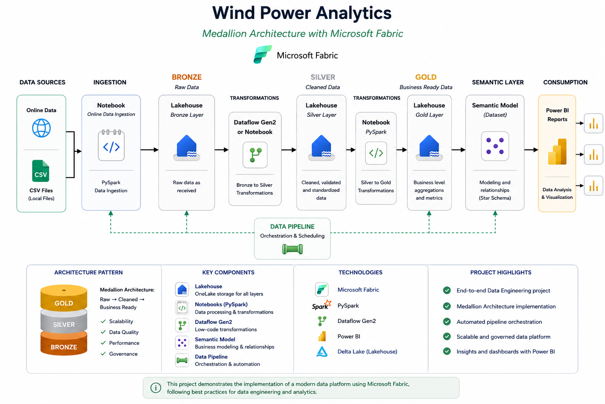

# 🌬️ Wind Power Analytics using Microsoft Fabric

An end-to-end Data Engineering project built with **Microsoft Fabric**, implementing the **Medallion Architecture** to ingest, transform, store, and analyze wind power generation data.

---

# 🏗️ Architecture



The solution follows the Medallion Architecture, separating the data platform into Bronze, Silver, and Gold layers to improve data quality, governance, and scalability.

---

# 🚀 Technology Stack

| Category | Technology |
|----------|------------|
| Data Platform | Microsoft Fabric |
| Storage | Lakehouse (OneLake) |
| Processing | PySpark Notebooks |
| Data Transformation | Dataflow Gen2, SQL |
| Orchestration | Data Pipeline |
| Data Modeling | Semantic Model |
| Visualization | Power BI |

---

# 📊 Data Flow

```
Online Data / CSV Files
            │
            ▼
     Data Ingestion
      (PySpark Notebook)
            │
            ▼
     Bronze Lakehouse
            │
            ▼
 Bronze → Silver Transformations
 (Notebook / Dataflow Gen2)
            │
            ▼
     Silver Lakehouse
            │
            ▼
 Silver → Gold Transformations
      (PySpark Notebook)
            │
            ▼
      Gold Lakehouse
            │
            ▼
      Semantic Model
            │
            ▼
     Power BI Reports
```

---

# 📂 Project Structure

```
.
├── architecture/
├── notebooks/
├── pipeline/
├── report/
├── sql/
└── README.md
```

---

# 🥉 Bronze Layer

The Bronze layer stores the raw data exactly as it is received from the source systems.

**Responsibilities**

- Store raw datasets
- Preserve historical data
- No business transformations
- Support data lineage and auditing

---

# 🥈 Silver Layer

The Silver layer is responsible for data cleansing, validation, and standardization.

**Transformations performed**

- Data quality validation
- Missing value handling
- Data type conversion
- Time parsing
- Derived columns
- Data enrichment

The resulting dataset is optimized for analytical processing.

---

# 🥇 Gold Layer

The Gold layer contains business-ready datasets designed for reporting and analytics.

This layer includes:

- Aggregated metrics
- Business calculations
- Optimized analytical tables
- Semantic Model integration
- Power BI reporting

---

# ⚙️ Pipeline Orchestration

The complete workflow is orchestrated using **Microsoft Fabric Data Pipelines**, ensuring that every stage of the Medallion Architecture is executed in the correct order.

Pipeline execution:

1. Ingest raw data
2. Load Bronze Lakehouse
3. Transform Bronze → Silver
4. Load Silver Lakehouse
5. Transform Silver → Gold
6. Load Gold Lakehouse
7. Refresh Semantic Model
8. Update Power BI Reports

---

# 📈 Project Highlights

- ✅ End-to-end Data Engineering solution
- ✅ Microsoft Fabric implementation
- ✅ Medallion Architecture
- ✅ Lakehouse architecture
- ✅ PySpark data processing
- ✅ SQL transformations
- ✅ Dataflow Gen2 integration
- ✅ Automated pipeline orchestration
- ✅ Semantic Model
- ✅ Power BI dashboard

# 💡 Skills Demonstrated

- Data Engineering
- Microsoft Fabric
- Lakehouse Architecture
- ETL / ELT
- PySpark
- SQL
- Data Modeling
- Delta Lake
- Data Pipeline Orchestration
- Business Intelligence
- Data Analytics