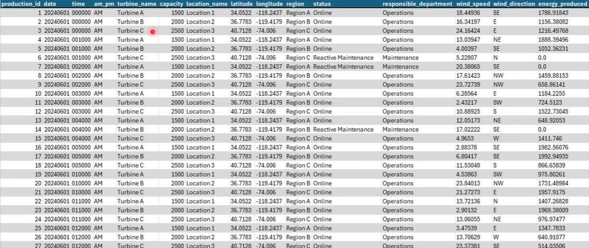

# Project Overview

This project demonstrates the implementation of an end-to-end data engineering solution using **Microsoft Fabric** to process, transform, and analyze wind power generation data.

A fictional renewable energy company operates a wind farm with three wind turbines. Every 10 minutes, IoT sensors collect operational and production metrics, including energy generation, wind speed, wind direction, turbine status, and geographic information.

The objective is to build a scalable analytics platform following the **Medallion Architecture (Bronze, Silver, and Gold)**, enabling reliable data ingestion, transformation, storage, and business reporting.

## Business Scenario

The solution is designed to:

- Ingest raw data from multiple sources.
- Store immutable raw data in the Bronze layer.
- Clean, validate, and enrich data in the Silver layer.
- Create business-ready datasets in the Gold layer.
- Build a Semantic Model for analytics.
- Deliver interactive dashboards through Power BI.

## Sample Dataset

A sample of the input dataset is shown below:

